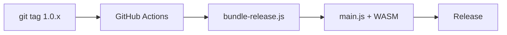

<div align="center">


# MergDown2TeX

> **Merge everything. Convert anywhere.**
> Moteur WASM embarqué dans Obsidian. Aucune étape de compilation, aucun binaire à installer.

[](https://obsidian.md)
[](LICENSE)
[](https://dvrch.github.io/mergdown2tex/)

</div>

---

## What it does

MergDown2TeX transforme une note Obsidian en un document **prêt à publier** (LaTeX, PDF, DOCX, InDesign). Tout est fusionné automatiquement :

| Entrée | Sortie |
|---|---|
| `[[Wikilinks]]` | `\hyperref[...]{}` références croisées |
| `![[Notes embarquées]]` | Expansion récursive contenue |
| `![[image.png]]` | `\includegraphics{}` |
| `@citation` | `\citep{}` + flèches bidirectionnelles (↑↓) |
| `$math$` / `$$math$$` | Équations LaTeX |
| Blocs Mermaid | Rendu automatique en PNG (client-side) |
| `> [!note]` admonitions | environnements `tcolorbox` |
| Note de bas de page, tableaux, listes | Support LaTeX complet |
| Ancres de blocs (`^table--block-…`) | Objets Word/LaTeX numérotés et référencés |

**Formats de sortie :**
- **PDF** — Pandoc WASM + Typst (par défaut, fonctionne sur mobile) *ou* pdflatex + Podman (PC, LaTeX natif)
- **DOCX** — Pandoc WASM embarqué
- **.typ** — intermédiaire Typst
- **.expanded.md** — Markdown étendu autonome (embeds/liens résolus)
- **InDesign** compatible

---

## How it works

```
┌─────────────────────────────────────────────────────────┐
│  Obsidian Note                                          │
│  ├── [[Note A]]          ──→  \hyperref + expansion    │
│  ├── ![[Note B]]         ──→  recursive expansion      │
│  ├── ![[image.png]]      ──→  \includegraphics{}       │
│  ├── @citation           ──→  \citep{} + arrows ↑↓     │
│  ├── $math$              ──→  LaTeX equation            │
│  └── ```mermaid```       ──→  PNG (bundle embarqué)     │
└─────────────────────────────────────────────────────────┘
                        │
                        ▼
┌─────────────────────────────────────────────────────────┐
│  WASM Engine (embarqué dans main.js, Base64)            │
│  ├── Markdown → LaTeX conversion (moteur Rust/WASM)     │
│  ├── Embed expansion + wikilinks + ancres de blocs      │
│  ├── Citation extraction + navigation (↑↓)              │
│  └── Mermaid → PNG (mermaid.min.js embarqué)            │
└─────────────────────────────────────────────────────────┘
                        │
                        ▼
┌─────────────────────────────────────────────────────────┐
│  Compilation (auto, sans installation)                  │
│  ├── pandoc.wasm   : .tex → .docx                       │
│  ├── typst.wasm    : .typ → .pdf                        │
│  └── (option) pdflatex + Podman : .tex → .pdf (PC)      │
└─────────────────────────────────────────────────────────┘
```

---

## Dependencies

| Étape | Ce qu'il faut | Statut |
|---|---|---|
| Markdown → LaTeX | Aucun (moteur WASM embarqué dans `main.js`) | **Aucune** |
| LaTeX → PDF (défaut) | `pandoc.wasm` + `typst.wasm` (auto-téléchargés) | **Aucune** |
| LaTeX → PDF (natif, option PC) | TeX Live + Podman/Docker | Optionnelle |
| LaTeX → DOCX | `pandoc.wasm` (auto-téléchargé) | **Aucune** |
| Rendu Mermaid | Bundle embarqué dans `main.js` | **Aucune** |

`pandoc.wasm` (~59 MB), `typst.wasm` (~28 MB) et leurs polices sont **auto-téléchargés** dans `wasm/` au premier export (bouton manuel dans les réglages sinon).

> **PDF natif LaTeX (optionnel, PC)** — construit le conteneur :
> ```bash
> podman build -t vlatex-env -f Dockerfile.vlatex .
> # ou : docker build -t vlatex-env -f Dockerfile.vlatex .
> ```

---

## Install

### Manuel

1. Télécharge `main.js` et `manifest.json` depuis [Releases](https://github.com/dvrch/mergdown2tex/releases)
2. Copie-les dans `.obsidian/plugins/mergdowntotex/`
3. Active dans **Settings → Community Plugins**

`main.js` (~8.6 MB) embarque le moteur de conversion **et** le bundle Mermaid en Base64. Les moteurs `pandoc.wasm`/`typst.wasm` sont auto-téléchargés au premier export.

### Structure du plugin (release et vault exemple)

```
mergdowntotex/                        ← dossier du plugin (id = mergdowntotex)
├── main.js          ~8.6 MB          ← plugin + moteur WASM + mermaid (Base64)
├── manifest.json     351 B           ← métadonnées
├── wasm/                             ← auto-téléchargé (pandoc.wasm, typst.wasm, fonts)
└── resources/                        ← ressources (CSL/BIB auto-hébergés)
```

> **Vault exemple** : `example_vault/full_manual_repport_exp.zip` contient un vault prêt à l'emploi avec le plugin déjà installé (`.obsidian/plugins/mergdowntotex/`). Cette installation est **strictement identique** à celle de la release (mêmes `main.js`, `manifest.json`, `wasm/`, `resources/`).

---

## Commands

| Commande | Action |
|---|---|
| `Convertir la note active en LaTeX (.tex)` | Génère le `.tex` |
| `Convertir et compiler en PDF` | Génère le PDF (pipeline auto) |
| `Convertir et compiler en DOCX (Word)` | Génère le Word (Pandoc WASM) |
| `Générer le Markdown étendu (.expanded.md)` | Génère le Markdown autonome |
| `Reconvertir le .tex (jumeau) en Markdown` | `.tex` → Markdown |
| `Compile le .tex jumeau en PDF` | `.tex` → PDF |
| `Compile le .tex jumeau en DOCX` | `.tex` → DOCX |
| `Convertit le .tex jumeau en .typ` | `.tex` → Typst |
| `Compile le .typ jumeau en PDF` | `.typ` → PDF |
| `Aperçu PDF côte-à-côte (md → pdf)` | Aperçu interactif |
| `ZIP des ressources liées (_exp.zip)` | Archive les ressources |

*Raccourci rapide : bouton PDF dans le ruban.*

---

## Why MergDown2TeX?

| | Pandoc Plugin | Pandoc CLI | Pandoc GUI | **MergDown2TeX** |
|---|---|---|---|---|
| Installation requise | Pandoc + TeX Live | Pandoc + TeX Live | Pandoc + TeX Live (GUI) | **Aucune (WASM embarqué)** |
| Résolution Wikilinks | ❌ | ❌ | ❌ | ✅ |
| Expansion des embeds | ❌ | ❌ | ❌ | ✅ |
| Flèches de citation (↑↓) | ❌ | ❌ | ❌ | ✅ |
| Mermaid → PNG | ❌ | ❌ | ❌ | ✅ |
| Ancres de blocs / objets Word | ❌ | ❌ | ❌ | ✅ |
| Preamble personnalisé | Partiel | Manuel | Manuel | ✅ |
| Sortie InDesign | ❌ | ❌ | ❌ | ✅ |
| **Mobile (iOS/Android)** | ⚠️ | ⚠️ | ⚠️ | ✅ |
| PAPER libre / zero-install | ⚠️ | ⚠️ | ⚠️ | ✅ |

*Pandoc GUI (plugin Obsidian `pandoc-gui`) fournit une interface de conversion mais requiert toujours Pandoc + un environnement LaTeX externe et ne résout pas les wikilinks/embeds Obsidian natifs.*

---

## vlatex & le moteur WASM

Le moteur de conversion (et son outillage) est développé dans le projet **vlatex**. Pour en savoir plus sur `vlatex` / `vlatex wasm` et son intégration avec Obsidian :

> **[https://dvrch.github.io/vlatex/obsidian/](https://dvrch.github.io/vlatex/obsidian/)**

---

## Architecture

**Release** (2 fichiers) :

```
mergdowntotex/
├── main.js          ~8.6 MB   ← plugin + moteur WASM (Base64) + mermaid (Base64)
└── manifest.json     351 B    ← metadata
```

`main.js` embarque :
- le **moteur de conversion** WASM (Markdown → LaTeX), encodé en Base64 (`WASM_BASE64`) ;
- le **bundle Mermaid** (`mermaid.min.js`), encodé en Base64 (`MERMAID_BASE64`) pour le rendu client-side, y compris sur mobile.

Les moteurs **`pandoc.wasm`/`typst.wasm`** (trop volumineux pour être embarqués) sont auto-téléchargés dans `wasm/` au premier export.

**Développement** (dans le repo) :

```
mergdowntotex/
├── main.js          ~8.6 MB   ← même fichier que la release
├── manifest.json     351 B
├── wasm/
│   ├── pandoc.wasm   ~59 MB
│   ├── typst.wasm    ~28 MB
│       └── fonts/
└── resources/
    └── csl/                     ← styles de citation auto-hébergés
```

> **Mermaid** : le bundle `mermaid.min.js` est **embarqué en Base64 dans `main.js`** (`MERMAID_BASE64`) — il n'est pas distribué séparément dans `resources/`.
scripts/
└── bundle-release.js            ← encode WASM → Base64 → injecte dans main.js
```

**Build release automatisé** par GitHub Actions :



**Zero build step. Moteur WASM embarqué dans main.js à la release.**

---

## Troubleshooting

### « WASM module not loaded »
- Vérifie que `main.js` fait bien ~8.6 MB (un fichier plus petit = build dev sans moteur embarqué)
- Re-télécharge la release si le fichier semble corrompu
- Redémarre Obsidian

### `pandoc.wasm` / `typst.wasm` introuvable
- Lance un export, ou clique sur le bouton de téléchargement dans les réglages
- Vérifie la connexion internet (59 MB + 28 MB)

### « podman: command not found » (PDF natif)
- Installe Podman/Docker, **ou** active *PDF PC via Wasm+Typst* dans les réglages (aucune installation)

---

## License

MIT

---

## Support

- [GitHub Issues](https://github.com/dvrch/mergdown2tex/issues)
- [Documentation](https://dvrch.github.io/mergdown2tex/)
