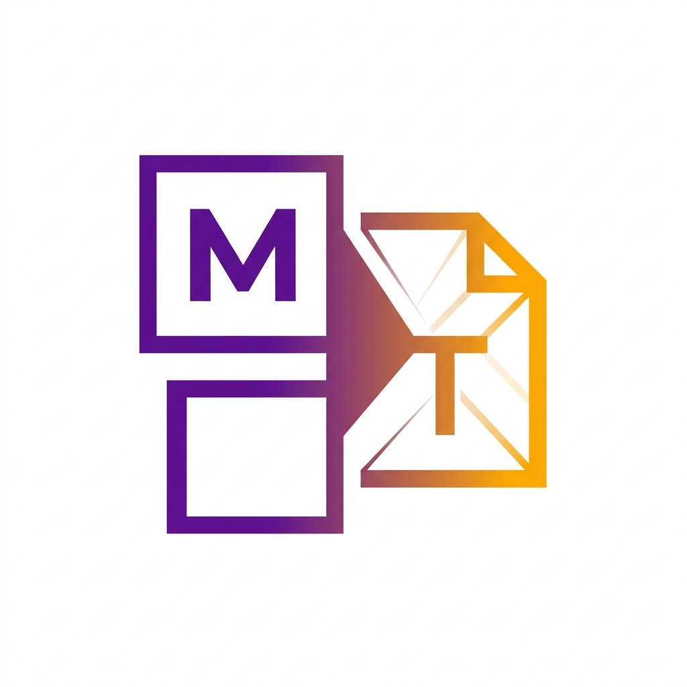
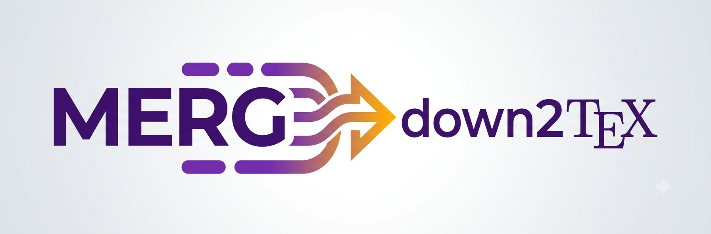

# MergDown2TeX Logo Usage Guidelines

## Logo Variants

### Square Icon (`logo-icon.png`)

**Usage:**
- Favicon
- Plugin icon
- Small sizes (32x32, 64x64, 128x128)
- Social media profile pictures
- App icons

### Horizontal Text (`logo-horizontal.png`)

**Usage:**
- README header
- Documentation header
- Website banners
- Social media headers
- Print materials

## Color Palette

| Color | Hex | Usage |
|---|---|---|
| Deep Purple | #6A0DAD | Primary color |
| Amber | #FFB300 | Accent color |
| Charcoal | #333333 | Text |

## Minimum Size

| Variant | Print | Screen |
|---|---|---|
| Square icon | 15mm | 32px |
| Horizontal | 50mm | 200px |

## Clear Space

Maintain minimum clear space around the logo equal to the height of the "M" in "MergDown2TeX".

## Don'ts

- Don't stretch or distort the logo
- Don't change the colors
- Don't add effects (shadows, glows)
- Don't place on busy backgrounds without contrast
- Don't rotate the logo

## File Naming

| File | Format | Size |
|---|---|---|
| `logo-icon.png` | PNG | 128x128 |
| `logo-horizontal.png` | PNG | 800x200 |
| `favicon.ico` | ICO | 32x32 |
