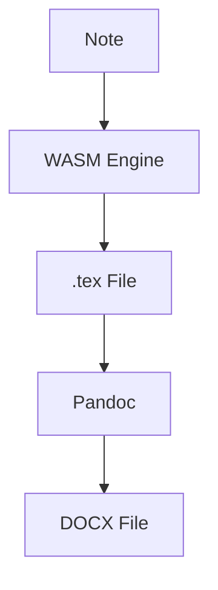

# DOCX Compilation

MergDown2TeX compiles LaTeX to DOCX using Pandoc.

---

## How it works



---

## Requirements

- **Pandoc** (inside container)
- **TeX Live** (for bibliography)

---

## Compile DOCX

### Option A: Command Palette

1. Open command palette (`Ctrl/Cmd + P`)
2. Type "MergDown2TeX"
3. Select **"MergDown2TeX: Convertir et compiler en DOCX (Word)"**

### Option B: Button

Click the **DOCX** button in the ribbon.

### Option C: Bash script

```bash
#!/bin/bash
# compile-docx.sh

INPUT="document.tex"
CONTAINER="mergdown2tex-env"

# Copy file to container
podman cp "$INPUT" "$CONTAINER:/vault/"

# Compile with Pandoc
podman exec "$CONTAINER" pandoc "$INPUT" -o "${INPUT%.tex}.docx"

# Copy back
podman cp "$CONTAINER:/vault/${INPUT%.tex}.docx" .
```

---

## Pandoc options

### Default

```bash
pandoc document.tex -o document.docx
```

### With bibliography

```bash
pandoc document.tex --bibliography=references.bib -o document.docx
```

### With reference document

```bash
pandoc document.tex --reference-doc=template.docx -o document.docx
```

---

## DOCX features

### Automatic conversion

| LaTeX | DOCX |
|---|---|
| `\section{}` | Heading 1 |
| `\subsection{}` | Heading 2 |
| `\textbf{}` | Bold |
| `\textit{}` | Italic |
| `\citep{}` | Citation |
| `\includegraphics{}` | Image |
| `\begin{table}` | Table |
| `\begin{equation}` | Equation |

### Custom styles

Create a reference DOCX:

```bash
# Generate reference
pandoc -o reference.docx --print-default-data-file reference.docx

# Customize in Word
# Use as reference
pandoc document.tex --reference-doc=reference.docx -o output.docx
```

---

## Troubleshooting

### Pandoc not found

**Error:**
```
pandoc: command not found
```

**Solution:**
- Rebuild container with Pandoc
- Check Dockerfile includes `pandoc`

### Bibliography not working

**Error:**
```
Citation not found
```

**Solution:**
- Include `--bibliography` flag
- Check `.bib` file path

### Images not showing

**Error:**
```
Image not found
```

**Solution:**
- Check image paths
- Use absolute paths
- Include images in DOCX

---

## Next steps

- [PDF Compilation](pdf.md) - PDF output
- [LaTeX Compilation](latex.md) - Manual compilation
- [Configuration](../getting-started/configuration.md) - Customize settings
