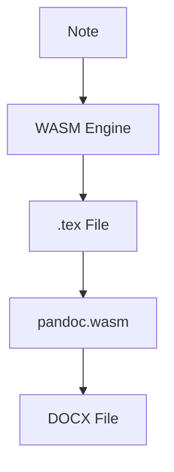

# Compilation DOCX

MergDown2TeX compile un `.docx` **directement dans Obsidian** grâce à **Pandoc WASM** embarqué. **Aucune installation externe de Pandoc ni de Podman n'est requise.**

---

## Comment ça marche


```mermaid
graph TD
    A[Note] --> B[WASM Engine]
    B --> C[.tex File]
    C --> D[pandoc.wasm]
    D --> E[DOCX File]
```

1. Le moteur WASM convertit le Markdown en `.tex`
2. `pandoc.wasm` (embarqué) convertit le `.tex` en `.docx` avec `--mathml`, `--embed-resources`, `--standalone`, `--toc`
3. Le plugin applique un post-traitement (numérotation des sections, flèches de navigation) directement sur le DOCX

---

## Exigences

- **Rien** : `pandoc.wasm` est auto-téléchargé dans `wasm/` au premier lancement (bouton de téléchargement dans les réglages si besoin).

!!! success "Zéro dépendance"
    Contrairement à de nombreux plugins, il n'y a **ni Pandoc CLI, ni Podman/Docker, ni TeX Live** à installer pour produire un DOCX. Cela fonctionne y compris sur **mobile** (Android/iOS).

---

## Compiler un DOCX

### Option A : Palette de commandes

1. Ouvrez la palette (`Ctrl/Cmd + P`)
2. Sélectionnez **`MergDown2TeX: Convertir et compiler en DOCX (Word)`**

### Option B : Depuis un `.tex` existant

- `MergDown2TeX: Compile le .tex jumeau en DOCX (reprend le .tex produit)`

---

## Options Pandoc appliquées

Le post-traitement DOCX gère notamment :

| Aspect | Traitement |
|---|---|
| Équations | `--mathml` (OMML dans Word) |
| Ressources (images) | Intégrées (`--embed-resources`) |
| Table des matières | `--toc` |
| Bibliographie | `--citeproc` si `.bib` fourni |
| Sections | Numérotation de sections (optionnel) |
| Citations | Flèches de retour ↑↓ (voir [Cross-References](../features/cross-references.md)) |
| Tableaux | Largeurs de colonnes préservées, `@{}c` pour les sous-figures |

---

## Tableaux & ancres de blocs dans le DOCX

Les blocs porteurs d'une **ancre de bloc** sont correctement convertis en objets Word avec labels et hypertargets fonctionnels :

```markdown
| Col 1 | Col 2 |
|-------|-------|
| Val 1 | Val 2 |
^table--block-my-table          ← ancre immédiatement après le bloc
```

Pour les équations et les figures, utilisez respectivement `^eq--block-…` et `^figure--block-…`.

Voir [Cross-References](../features/cross-references.md) pour le détail.

---

## Fichier de sortie

| Fichier | Rôle |
|---|---|
| `document.docx` | Document Word final |

---

## Dépannage

### "pandoc.wasm absent — téléchargement automatique en cours..."

C'est normal au premier lancement. Patientez (fichier ~59 MB) ou cliquez sur le bouton de téléchargement manuel dans les réglages (*Moteur Pandoc WASM*).

### "❌ Erreur Pandoc WASM: ..."

- Vérifiez que `pandoc.wasm` est présent dans `wasm/`
- Consultez la console pour le message détaillé
- Réessayez après avoir re-téléchargé `pandoc.wasm`

### Les flèches de citation n'apparaissent pas

- Désactivez/activez le réglage *flèches de navigation* dans les réglages
- Vérifiez que le `.bib` est correctement configuré

### Images manquantes dans le DOCX

- Vérifiez les chemins des images dans la note
- Les images web peuvent être désactivées via le réglage `downloadWebImages`

---

## Étapes suivantes

- [Compilation PDF](pdf.md) - Sortie PDF
- [Compilation LaTeX](latex.md) - Compilation manuelle
- [Configuration](../getting-started/configuration.md) - Personnaliser les réglages
