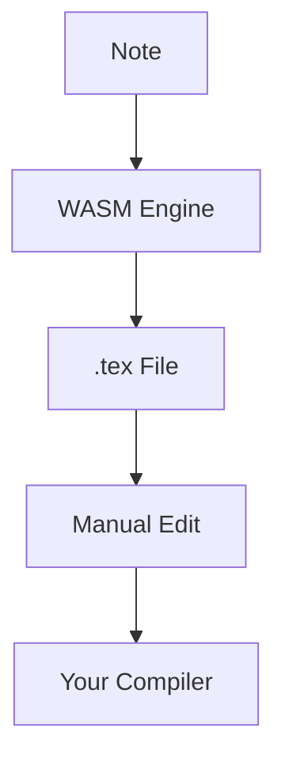

# LaTeX Compilation

MergDown2TeX generates `.tex` files for manual compilation.

---

## How it works



---

## Generate .tex file

### Option A: Command Palette

1. Open command palette (`Ctrl/Cmd + P`)
2. Type "MergDown2TeX"
3. Select **"MergDown2TeX: Convertir la note active en LaTeX (.tex)"**

### Option B: Button

Click the **LaTeX** button in the ribbon.

---

## Output structure

### Basic structure

```latex
\documentclass[12pt]{report}
\usepackage[utf8]{inputenc}
\usepackage[T1]{fontenc}
\usepackage{hyperref}
\usepackage{cite}
\usepackage{graphicx}
\usepackage{amsmath}
\usepackage{amssymb}
\usepackage{minted}
\usepackage{tcolorbox}

\title{Document Title}
\author{Author Name}

\begin{document}

\maketitle

\tableofcontents

\section{Introduction}
Content here...

\section{Methods}
Content here...

\section{Results}
Content here...

\bibliographystyle{plain}
\bibliography{references}

\end{document}
```

### With custom preamble

```latex
\documentclass[12pt]{report}
\usepackage[utf8]{inputenc}
\usepackage[T1]{fontenc}

% Custom preamble
\usepackage{tikz}
\usepackage{siunitx}
\usepackage{booktabs}

\title{Document Title}

\begin{document}

\maketitle

\section{Introduction}
Content here...

\end{document}
```

---

## Manual compilation

### Using TeX Live

```bash
# First pass
pdflatex document.tex

# Bibliography
bibtex document

# Second pass
pdflatex document.tex

# Third pass
pdflatex document.tex
```

### Using Overleaf

1. Upload `.tex` file
2. Upload `.bib` file
3. Click "Recompile"

### Using online compiler

- [Overleaf](https://www.overleaf.com)
- [Papeeria](https://www.papeeria.com)
- [CoCalc](https://cocalc.com)

---

## Customization

### Edit .tex file

1. Open generated `.tex` file
2. Make changes
3. Compile with your preferred method

### Add packages

```latex
\usepackage{your-package}
```

### Modify preamble

```latex
\usepackage[options]{package}
```

### Change document class

```latex
\documentclass[options]{class}
```

---

## Tips

### Best practices

1. **Edit the .tex file** for final touches
2. **Use version control** (git)
3. **Keep backup** of important documents
4. **Test changes** incrementally

### Common modifications

- Add custom commands
- Modify styles
- Include additional packages
- Adjust margins
- Change fonts

---

## Troubleshooting

### Compilation errors

**Error:**
```
Missing $ inserted
```

**Solution:**
- Check math mode
- Escape special characters

### Undefined references

**Error:**
```
Reference '...' on page ... undefined
```

**Solution:**
- Run pdflatex multiple times
- Check label/cite syntax

---

## Next steps

- [PDF Compilation](pdf.md) - Automated PDF output
- [DOCX Compilation](docx.md) - Word document output
- [Configuration](../getting-started/configuration.md) - Customize settings
