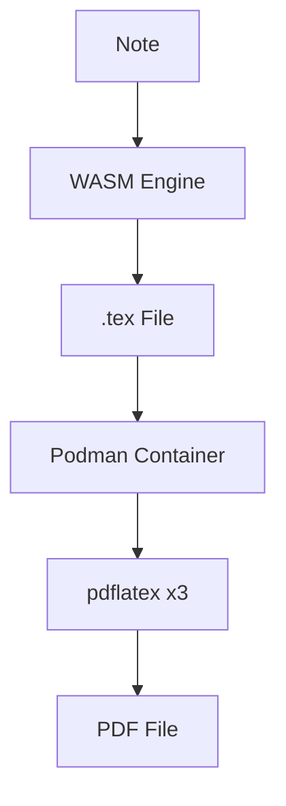
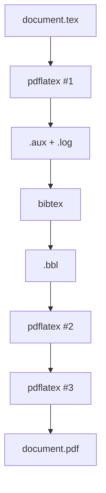

# PDF Compilation

MergDown2TeX compiles LaTeX to PDF using Podman.

---

## How it works



---

## Requirements

- **Podman** or **Docker**
- **TeX Live** (inside container)

---

## Build container

### Download Dockerfile

```bash
# From GitHub release
curl -L -o Dockerfile https://github.com/dvrch/mergdown2tex/releases/download/v1.0.0/Dockerfile
```

### Build image

```bash
# With Podman
podman build -t mergdown2tex-env -f Dockerfile .

# With Docker
docker build -t mergdown2tex-env -f Dockerfile .
```

### Verify

```bash
# List images
podman images | grep mergdown2tex-env

# Test
podman run --rm mergdown2tex-env pdflatex --version
```

---

## Compile PDF

### Option A: Command Palette

1. Open command palette (`Ctrl/Cmd + P`)
2. Type "MergDown2TeX"
3. Select **"MergDown2TeX: Convertir et compiler en PDF"**

### Option B: Button

Click the **PDF** button in the ribbon.

### Option C: Bash script

```bash
#!/bin/bash
# compile.sh

INPUT="document.tex"
CONTAINER="mergdown2tex-env"

# Copy file to container
podman cp "$INPUT" "$CONTAINER:/vault/"

# Compile
podman exec "$CONTAINER" pdflatex -interaction=nonstopmode "$INPUT"
podman exec "$CONTAINER" bibtex "${INPUT%.tex}"
podman exec "$CONTAINER" pdflatex -interaction=nonstopmode "$INPUT"
podman exec "$CONTAINER" pdflatex -interaction=nonstopmode "$INPUT"

# Copy back
podman cp "$CONTAINER:/vault/${INPUT%.tex}.pdf" .
```

---

## Compilation process

### 1. pdflatex (first pass)

```bash
pdflatex -interaction=nonstopmode document.tex
```

- Generates `.aux` file
- Resolves references

### 2. bibtex

```bash
bibtex document
```

- Processes bibliography
- Generates `.bbl` file

### 3. pdflatex (second pass)

```bash
pdflatex -interaction=nonstopmode document.tex
```

- Incorporates bibliography
- Updates references

### 4. pdflatex (third pass)

```bash
pdflatex -interaction=nonstopmode document.tex
```

- Final pass
- Resolves all references



---

## Output files

| File | Description |
|---|---|
| `document.pdf` | Final PDF |
| `document.log` | Compilation log |
| `document.aux` | Auxiliary file |
| `document.bbl` | Bibliography |
| `document.blg` | BibTeX log |
| `document.out` | Hyperref links |
| `document.toc` | Table of contents |

---

## Troubleshooting

### Container not found

**Error:**
```
Error: no such container: mergdown2tex-env
```

**Solution:**
- Build container: `podman build -t mergdown2tex-env -f Dockerfile .`
- Or start existing: `podman start mergdown2tex-env`

### Compilation failed

**Error:**
```
pdflatex: command not found
```

**Solution:**
- Rebuild container with TeX Live
- Check Dockerfile includes `texlive-latex-base`

### Permission denied

**Error:**
```
Permission denied
```

**Solution:**
- Use `--privileged` flag:
  ```bash
  podman run --rm --privileged mergdown2tex-env pdflatex document.tex
  ```

### Timeout

**Error:**
```
Compilation timeout
```

**Solution:**
- Increase timeout in settings
- Simplify document
- Check for infinite loops

---

## Next steps

- [DOCX Compilation](docx.md) - Word document output
- [LaTeX Compilation](latex.md) - Manual compilation
- [Configuration](../getting-started/configuration.md) - Customize settings
