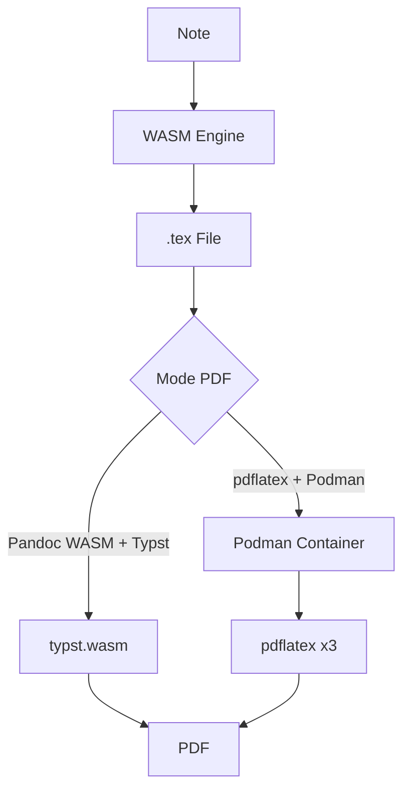
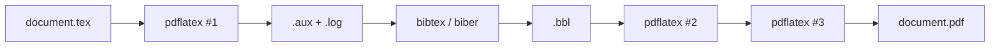

# Compilation PDF

MergDown2TeX produit un PDF de **deux façons** selon l'appareil et la configuration :

1. **Pandoc WASM + Typst** — recommandé, fonctionne partout (desktop **et** mobile), aucune installation externe.
2. **pdflatex + Podman/Docker** — rendu LaTeX natif, réservé au PC.

---

## Comment ça marche


```mermaid
graph TD
    A[Note] --> B[WASM Engine]
    B --> C[.tex File]
    C --> D{Mode PDF}
    D -->|Pandoc WASM + Typst| E[typst.wasm]
    E --> F[PDF]
    D -->|pdflatex + Podman| G[Podman Container]
    G --> H[pdflatex x3]
    H --> F[PDF]
```

---

## Mode 1 : Pandoc WASM + Typst (auto, mobile + desktop)

C'est le mode utilisé **par défaut sur mobile** et sur PC lorsqu'aucun Podman/pdflatex n'est disponible.

### Principe

1. Le moteur WASM convertit le Markdown en `.tex`
2. `pandoc.wasm` convertit le `.tex` en `.typ` (Typst)
3. `typst.wasm` compile le `.typ` en **PDF**

### Exigences

- **Aucune** : `pandoc.wasm` et `typst.wasm` sont auto-téléchargés dans `wasm/` au premier lancement.

### Activer sur PC

Dans les réglages, activez **`PDF PC via Wasm+Typst`** pour utiliser ce pipeline sur le PC (utile si vous n'avez ni pdflatex ni Podman). Les erreurs de compilation sont affichées à l'écran.

### Garder le `.typ`

Par défaut, le fichier `.typ` n'existe que temporairement en mémoire. Activez **`Garder le .typ à côté du .tex/PDF`** pour le sauvegarder dans le même dossier (utile pour l'inspecter ou le modifier).

### Compiler un `.typ` existant

- `MergDown2TeX: Compile le .typ jumeau en PDF (reprend le .typ produit)`

### Page de garde

Un PDF compilé via **Typst** reçoit une **page de garde simple** (une seule page isolée) qui affiche uniquement :

- le **titre** — d'abord le champ **`Titre du document`** des Réglages, sinon celui des métadonnées du fichier (front matter YAML `title`/`subtitle`, ou `\title{}`) ;
- l'**auteur** — d'abord le champ **`Auteur du document (Force)`** des Réglages, sinon celui des métadonnées (`author`/`\author{}`) ;
- la **date** — uniquement si elle provient des métadonnées (`date`/`\date{}`).

Le premier bloc du document n'est **jamais** utilisé comme contenu de la couverture. Si ni les Réglages ni les métadonnées ne fournissent un titre, **aucune page de garde n'est générée** (le document démarre directement par son sommaire).

### En-tête et pied de page

Les réglages **`En-tête personnalisé`** / **`Contenu de l'en-tête`** et **`Pied de page personnalisé`** / **`Contenu du pied de page`** s'appliquent **aussi en mode Typst**, avec un rendu équivalent à LaTeX :

- **En-tête** : texte aligné à droite, gris, 9 pt ;
- **Pied de page** : contenu du pied + **numéro de page** toujours affiché à droite (`\thepage` → `#context counter(page).display()`) ;
- **Ligne horizontale** grise sous l'en-tête et au-dessus du pied de page (présente dès que le réglage correspondant est activé).

Les métadonnées `\thetitle`, `\theauthor` et `\thedate`/`\today` sont traduites dans l'en-tête/pied.

### Diagrammes Mermaid

Dans le pipeline **Pandoc WASM + Typst**, les **étiquettes des diagrammes Mermaid sont maintenant rendues** dans le PDF : les blocs `<foreignObject>` (contenus HTML) sont automatiquement aplatis en éléments SVG `<text>` avant compilation, avec fonte, couleur et taille reprises des styles du diagramme. Auparavant, seules les formes (boîtes, flèches) apparaissaient.

---

## Mode 2 : pdflatex + Podman/Docker (PC, LaTeX natif)

Ce mode produit un rendu LaTeX **natif** (même résultat qu'un compilateur TeX classique).

### Exigences

- **Podman** ou **Docker**
- **TeX Live** (dans le conteneur)

### Construire le conteneur

```bash
# Avec Podman
podman build -t vlatex-env -f Dockerfile.vlatex .

# Avec Docker
docker build -t vlatex-env -f Dockerfile.vlatex .
```

### Vérifier

```bash
podman run --rm vlatex-env pdflatex --version
```

### Processus de compilation


```mermaid
graph LR
    A[document.tex] --> B[pdflatex #1]
    B --> C[.aux + .log]
    C --> D[bibtex / biber]
    D --> E[.bbl]
    E --> F[pdflatex #2]
    F --> G[pdflatex #3]
    G --> H[document.pdf]
```

Les commandes correspondent à :

```bash
pdflatex -interaction=nonstopmode -shell-escape document.tex
bibtex document          # ou : biber document
pdflatex -interaction=nonstopmode -shell-escape document.tex
pdflatex -interaction=nonstopmode -shell-escape document.tex
```

---

## Compiler le PDF

### Option A : Palette de commandes

1. Ouvrez la palette (`Ctrl/Cmd + P`)
2. Sélectionnez **`MergDown2TeX: Convertir et compiler en PDF`**

Le plugin choisit automatiquement le pipeline adapté (Typst si pas de Podman/pdflatex, ou selon le réglage `PDF PC via Wasm+Typst`).

### Option B : Depuis un `.tex` existant

- `MergDown2TeX: Compile le .tex jumeau en PDF (reprend le .tex produit)`

### Option C : Aperçu interactif

- `MergDown2TeX: Aperçu PDF côte-à-côte (mode interactif md → pdf)` — ou le bouton **PDF** du ruban

---

## Options du PDF

- `-interaction=nonstopmode`
- `-shell-escape` (mode natif)
- Navigation bidirectionnelle des citations (flèches ↑↓), voir [Cross-References](../features/cross-references.md)
- Ancres de blocs (`^table--block-…`, `^eq--block-…`, `^figure--block-…`) correctement numérotées et référencées

---

## Fichiers de sortie (mode natif)

| Fichier | Description |
|---|---|
| `document.pdf` | PDF final |
| `document.log` | Journal de compilation |
| `document.aux` | Fichier auxiliaire |
| `document.bbl` | Bibliographie |
| `document.blg` | Journal BibTeX |
| `document.out` | Liens hyperref |
| `document.toc` | Table des matières |

*(En mode Typst, ces fichiers auxiliaires LaTeX ne sont pas générés — seul le `.pdf`, et éventuellement le `.typ`.)*

---

## Dépannage

### "podman: command not found" (mode natif)

Installez Podman, ou activez **`PDF PC via Wasm+Typst`** dans les réglages pour utiliser le pipeline Typst (aucune installation).

### "vlatex-env: image not found" (mode natif)

```bash
podman build -t vlatex-env -f Dockerfile.vlatex .
```

### "Typst wrote no PDF" (mode Typst)

- Consultez les diagnostics affichés par le plugin
- Activez **`Garder le .typ`** pour inspecter le fichier Typst intermédiaire
- Vérifiez que `typst.wasm` et les polices sont bien installés (bouton de téléchargement dans les réglages)

### La compilation PDF échoue sur mobile

- Vérifiez que `pandoc.wasm` et `typst.wasm` sont téléchargés (connexion internet requise au premier lancement)
- Réduisez la complexité du document si nécessaire

---

## Étapes suivantes

- [Compilation DOCX](docx.md) - Document Word
- [Compilation LaTeX](latex.md) - Compilation manuelle
- [Configuration](../getting-started/configuration.md) - Personnaliser les réglages
