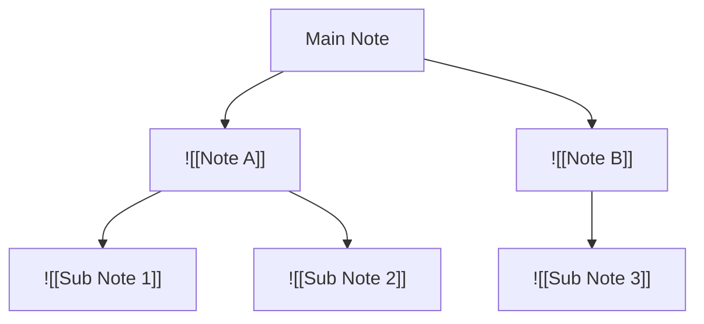
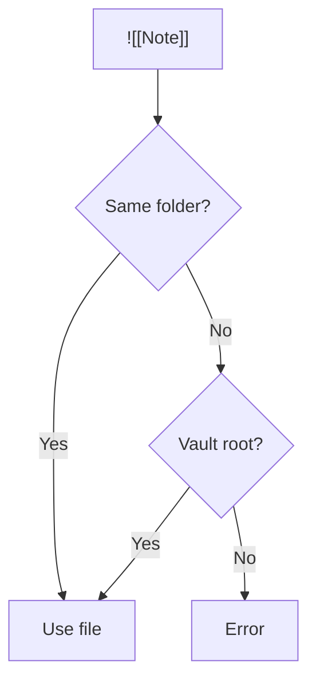
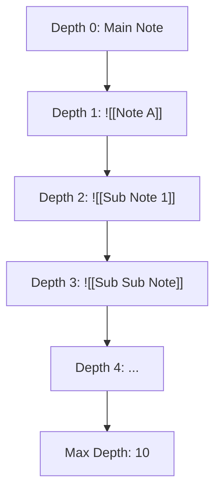
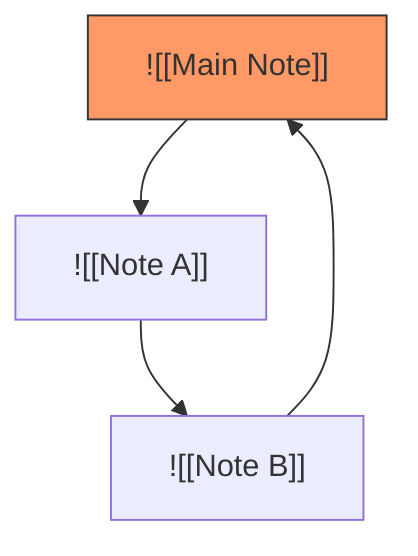
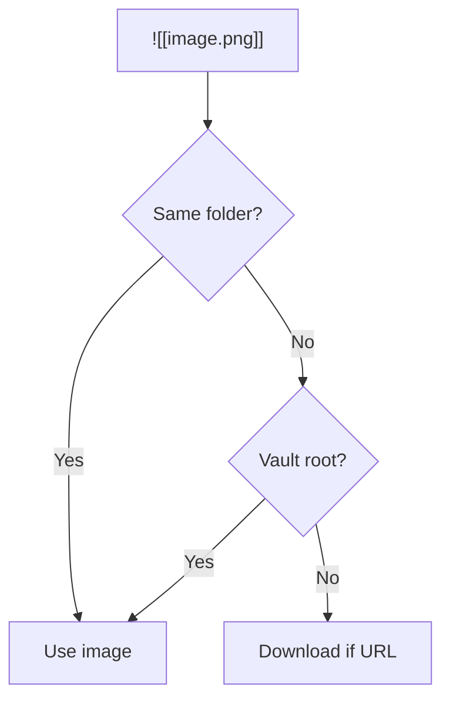

# Embed Expansion

MergDown2TeX recursively expands `![[Note]]` into your LaTeX document.

---

## How it works



---

## Syntax

### Basic embed

**Input:**
```markdown
![[Important Note]]
```

**Output:**
```latex
// Le contenu de « Important Note » est expansé inline dans le document.
```

!!! note "Expansion inline"
    Contrairement à un simple `\input{}`, MergDown2TeX **intègre directement le contenu** de la note embarquée dans le `.tex` (avec hiérarchie de sections ajustée). C'est ce qui permet de tout réunir dans un seul fichier autonome, y compris les blocs numérotés et les références croisées.

### Embed with heading

**Input:**
```markdown
![[Important Note#Methods]]
```

**Output:**
```latex
// Contenu de la section « Methods » de la note, intégré.
```

### Embed with block

**Input:**
```markdown
![[Important Note#^block-id]]
```

**Output:**
```latex
// Contenu du bloc référencé, intégré avec son ancre (si présente).
```

---

## Resolution

MergDown2TeX resolves embeds in two steps:



### Step 1: Same folder

Check the same folder as the current note:

```
folder/
├── main.md
├── note.md      ← Found!
└── subfolder/
    └── other.md
```

### Step 2: Vault root

If not found, check the vault root:

```
vault/
├── main.md
├── note.md      ← Found!
└── folder/
    └── other.md
```

---

## Depth limit

MergDown2TeX limits recursion depth to prevent infinite loops:



**Default:** 10 levels

**Configuration:**
```yaml
---
embedDepthLimit: 10
---
```

---

## Circular reference detection

MergDown2TeX detects and prevents circular references:



**Result:** Circular reference is skipped with a warning.

---

## Examples

### Example 1: Simple embed

**Note A.md:**
```markdown
---
title: "Methods"
---

# Methods

We used the following approach:

1. Data collection
2. Analysis
3. Results
```

**Main.md:**
```markdown
---
title: "Paper"
---

# Paper

![[Methods]]
```

**Output:**
```latex
\documentclass[12pt]{report}
\title{Paper}

\begin{document}

\section{Paper}

\input{methods}

\end{document}
```

### Example 2: Nested embeds

**Sub Note.md:**
```markdown
![[Sub Sub Note]]
```

**Note A.md:**
```markdown
![[Sub Note]]
```

**Main.md:**
```markdown
![[Note A]]
```

**Result:** All notes are recursively expanded.

---

## Image embeds

### Markdown syntax

**Input:**
```markdown
![[image.png]]
```

**Output:**
```latex
\includegraphics{figures/image.png}
```

### Image resolution



---

## Standalone expanded Markdown (.expanded.md)

MergDown2TeX peut produire un fichier Markdown **autonome** dans lequel tous les embeds sont **résolus** (le contenu des notes est intégré, plus aucune `![[…]]` restante).

### Commande

`MergDown2TeX: Générer le Markdown étendu (.expanded.md)`

### Fichier produit

Un fichier `NOM.expanded.md` est généré dans le dossier `.private/` du document. Ce fichier est **auto-contenu** :

- Embeds `![[Note]]` → contenu intégré
- Wikilinks `[[Note]]` → lien résolu
- Images → chemins relatifs corrects

### Marqueurs de navigation

Le fichier étendu inclut des **marqueurs de retour** pour faciliter la navigation dans le document final :

- **Flèches ↓↑** : indiquent les points d'ancrage (entrée/sortie) des blocs et sections
- **Marqueurs `BACKLINK`** : signalent les références inverses, pour retrouver d'où provient un contenu embarqué

```markdown
...contenu de la note embarquée...
^table--block-1
↑ BACKLINK → [[source note]]
```

Ces marqueurs sont ensuite utilisés pour la numérotation des blocs (`table--block-NNN`, `eq--block-NNN`, `figure--block-NNN`) et pour les références croisées dans le PDF/DOCX — voir [Cross-References](cross-references.md).

### ZIP des ressources liées

La commande `MergDown2TeX: ZIP des ressources liées de la note (_exp.zip)` archive toutes les ressources référencées (images, `.bib`, etc.) dans un fichier `_exp.zip`, pratique pour partager un document complet autonome.

---

## Troubleshooting

### Embed not found

**Error:**
```
Embed not found: [[Note]]
```

**Solution:**
- Check file exists in same folder or vault root
- Verify filename (case-sensitive)
- Check for typos

### Circular reference

**Error:**
```
Circular reference detected: [[Note A]] → [[Note B]] → [[Note A]]
```

**Solution:**
- Restructure notes to avoid circular references
- Use heading/block references instead

### Depth limit exceeded

**Error:**
```
Embed depth limit exceeded (10)
```

**Solution:**
- Reduce nesting depth
- Increase limit: `embedDepthLimit: 15`

---

## Next steps

- [Citations](citations.md) - Citation features
- [Cross-References](cross-references.md) - Navigation arrows
- [Configuration](../getting-started/configuration.md) - Customize settings
