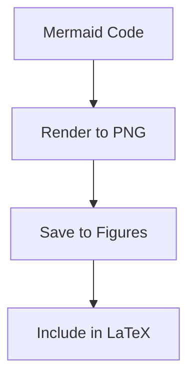
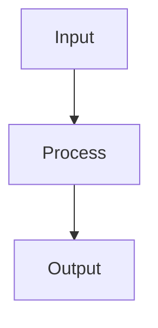
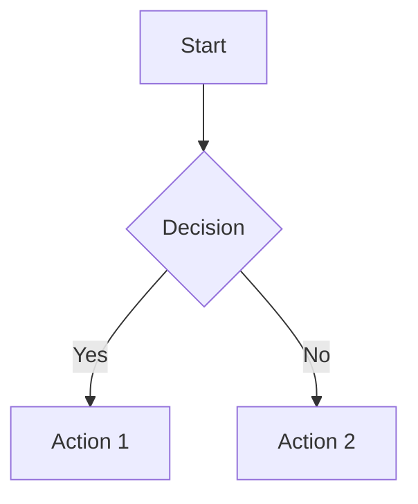
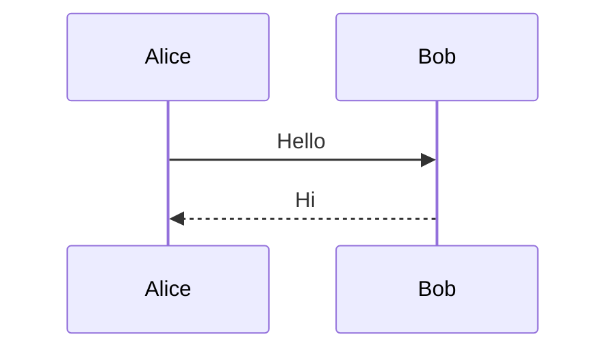
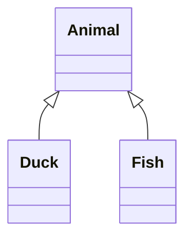
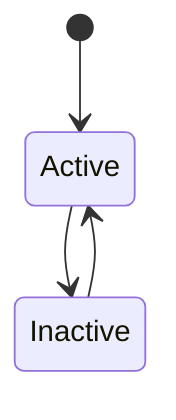
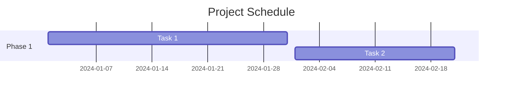
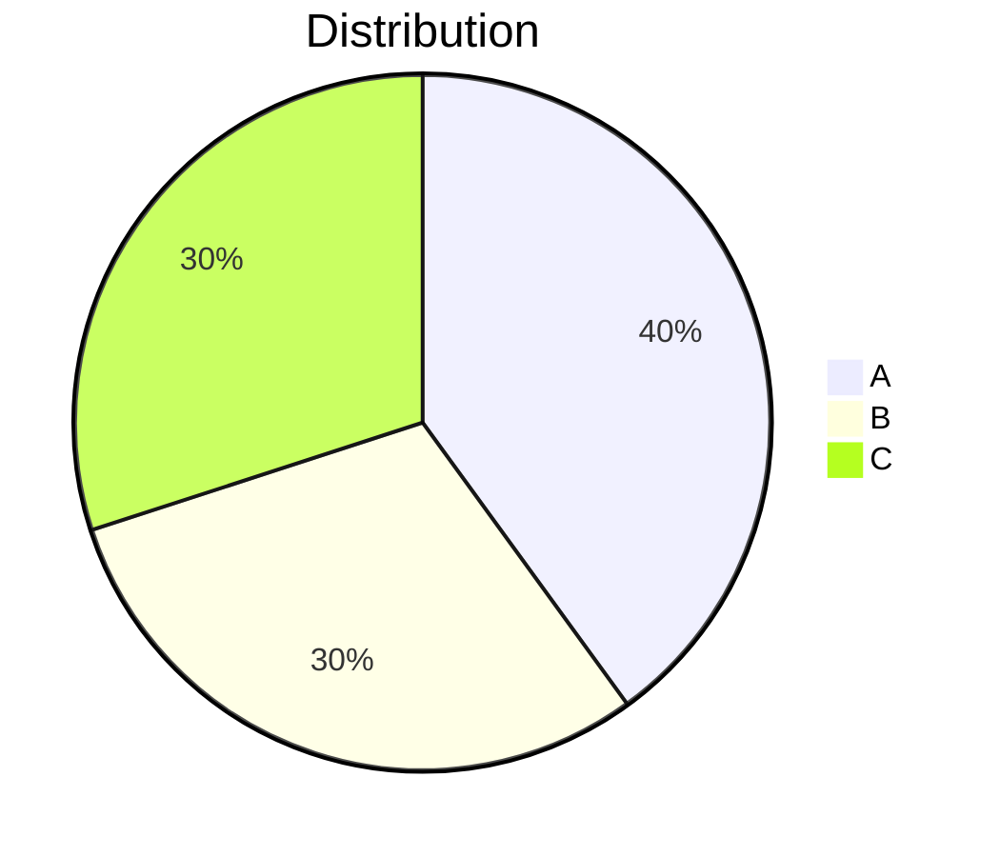

# Mermaid Diagrams

MergDown2TeX renders Mermaid diagrams to PNG images for LaTeX.

---

## How it works



---

## Syntax

### Basic diagram

**Input:**
````

````

**Output:**
```latex
\includegraphics{figures/diagram_1.png}
```

---

## Supported diagrams

### Flowchart

**Input:**
````

````

**Output:**
```latex
\includegraphics{figures/diagram_1.png}
```

### Sequence diagram

**Input:**
````

````

**Output:**
```latex
\includegraphics{figures/diagram_2.png}
```

### Class diagram

**Input:**
````

````

**Output:**
```latex
\includegraphics{figures/diagram_3.png}
```

### State diagram

**Input:**
````

````

**Output:**
```latex
\includegraphics{figures/diagram_4.png}
```

### Gantt chart

**Input:**
````

````

**Output:**
```latex
\includegraphics{figures/diagram_5.png}
```

### Pie chart

**Input:**
````

````

**Output:**
```latex
\includegraphics{figures/diagram_6.png}
```

---

## Configuration

### DPI setting

```yaml
---
mermaidDpi: 300
---
```

**Options:** `72`, `96`, `150`, `300`

### Image format

```yaml
---
mermaidFormat: png
---
```

**Options:** `png`, `svg`

---

## Image storage

### Default location

```
figures/
├── diagram_1.png
├── diagram_2.png
└── diagram_3.png
```

### Custom location

```yaml
---
imageFolder: assets/diagrams
---
```

---

## Troubleshooting

### Diagram not rendering

**Error:**
```
Mermaid render failed
```

**Solution:**
- Check Mermaid syntax
- Verify special characters are escaped
- Try simpler diagram first

### Image not found

**Error:**
```
File not found: figures/diagram_1.png
```

**Solution:**
- Check `figures/` folder exists
- Verify write permissions
- Check disk space

---

## Next steps

- [Cross-References](cross-references.md) - Navigation arrows
- [Configuration](../getting-started/configuration.md) - Customize settings
- [Compilation](../compilation/pdf.md) - PDF/DOCX options
