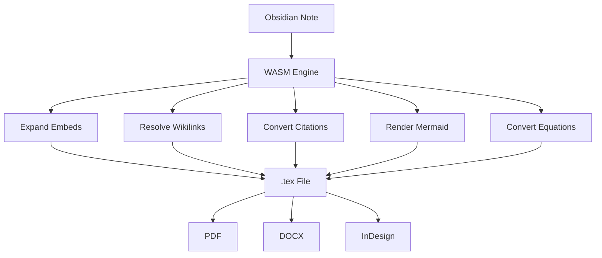
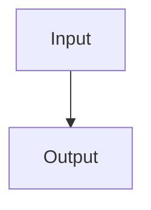
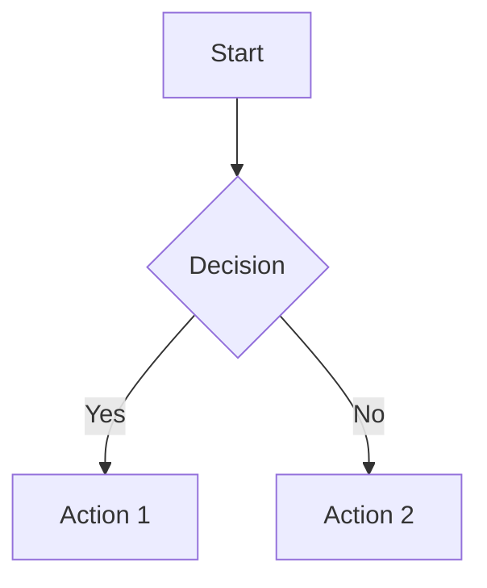
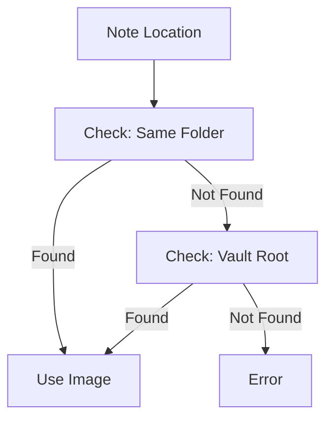

# Features Overview

MergDown2TeX converts Obsidian notes to publication-ready LaTeX documents.

---

## Core features



---

## Feature matrix

| Feature | Status | Description |
|---|---|---|
| Wikilinks | ✅ | `[[Note]]` → `\hyperref[...]{}` |
| Embeds | ✅ | `![[Note]]` → recursive expansion |
| Citations | ✅ | `@citation` → `\citep{}` + arrows |
| Equations | ✅ | `$math$` → LaTeX equations |
| Mermaid | ✅ | `` ```mermaid`` `` → PNG |
| Callouts | ✅ | `> [!note]` → tcolorbox |
| Footnotes | ✅ | `[^1]` → `\footnote{}` |
| Tables | ✅ | Markdown tables → LaTeX tables |
| Images | ✅ | `![[image.png]]` → `\includegraphics{}` |
| Cross-references | ✅ | Bidirectional navigation ↑↓ |

---

## Input → Output

### Wikilinks

**Input:**
```markdown
See [[Related Work]] for details.
```

**Output:**
```latex
See \hyperref[related-work]{Related Work} for details.
```

### Embeds

**Input:**
```markdown
![[Important Note]]
```

**Output:**
```latex
\input{important_note}
```

### Citations

**Input:**
```markdown
As shown by @smith2020...
```

**Output:**
```latex
As shown by \citep{smith2020}...
```

### Equations

**Input:**
```markdown
$$E = mc^2$$
```

**Output:**
```latex
\begin{equation}
E = mc^2
\end{equation}
```

### Mermaid diagrams

**Input:**
````

````

**Output:**
```latex
\includegraphics{figures/diagram_1.png}
```

### Callouts

**Input:**
```markdown
> [!note]
> This is important.
```

**Output:**
```latex
\begin{tcolorbox}[colback=blue!5!white, colframe=blue!75!black]
This is important.
\end{tcolorbox}
```

---

## Citation navigation

MergDown2TeX adds **bidirectional arrows** to citations:

```latex
% In text
As shown by \citep{smith2020}... ↑

% In bibliography
\textbf{Smith, J. (2020).} Important Research. ↓
```


---

## Embed expansion

MergDown2TeX recursively expands `![[Note]]` with depth limit:

```mermaid
graph TD
    A[Main Note] --> B[![[Note A]]]
    A --> C[![[Note B]]]
    B --> D[![[Sub Note 1]]]
    B --> E[![[Sub Note 2]]]
    C --> F[![[Sub Note 3]]]
```

**Features:**
- Depth limit (default: 10)
- Circular reference detection
- Filesystem resolution

---

## Mermaid rendering

MergDown2TeX renders Mermaid diagrams to PNG:

**Input:**
````

````

**Output:**
```latex
\includegraphics{figures/diagram_1.png}
```

**Supported diagrams:**
- Flowcharts
- Sequence diagrams
- Class diagrams
- State diagrams
- Gantt charts
- Pie charts

---

## Image resolution

MergDown2TeX resolves images relative to the markdown file:



---

## Next steps

- [Embed Expansion](embeds.md) - Detailed embed handling
- [Citations](citations.md) - Citation features
- [Equations](equations.md) - Equation support
- [Mermaid Diagrams](mermaid.md) - Diagram rendering
- [Cross-References](cross-references.md) - Navigation arrows
