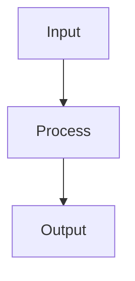

# Quick Start

Convert your first Obsidian note to LaTeX in 3 steps.

---

## Step 1: Open a note

Open any Obsidian note with markdown content. For example:

```markdown
---
title: "My Research Paper"
author: "John Doe"
---

# Introduction

This paper discusses [[Related Work]] and cites @smith2020.

## Methods

We use the formula $E = mc^2$.

![[Figure 1.png]]

## Results

Our findings show significant improvement.
```

---

## Step 2: Convert to LaTeX

### Option A: Command Palette

1. Open command palette (`Ctrl/Cmd + P`)
2. Type "MergDown2TeX"
3. Select **"MergDown2TeX: Convertir la note active en LaTeX (.tex)"**

### Option B: Button

Click the **MergDown2TeX** button in the ribbon (left sidebar).

---

## Step 3: View output

The plugin generates a `.tex` file in the same folder as your note:

```latex
\documentclass[12pt]{report}
\usepackage[utf8]{inputenc}
\usepackage[T1]{fontenc}
\usepackage{hyperref}
\usepackage{cite}
\usepackage{graphicx}
\usepackage{amsmath}

\title{My Research Paper}
\author{John Doe}

\begin{document}

\maketitle

\section{Introduction}
This paper discusses \hyperref[related-work]{Related Work} and cites \citep{smith2020}.

\section{Methods}
We use the formula $E = mc^2$.

\includegraphics{figures/figure_1.png}

\section{Results}
Our findings show significant improvement.

\end{document}
```

---

## Compile to PDF

### Option A: Command Palette

1. Open command palette (`Ctrl/Cmd + P`)
2. Type "MergDown2TeX"
3. Select **"MergDown2TeX: Convertir et compiler en PDF"**

### Option B: Button

Click the **PDF** button in the ribbon.

!!! info "Compilation process"
    The plugin:
    1. Converts markdown to LaTeX (WASM engine)
    2. Launches Podman container
    3. Runs pdflatex 3 times (for references)
    4. Returns PDF file

---

## Compile to DOCX

1. Open command palette (`Ctrl/Cmd + P`)
2. Type "MergDown2TeX"
3. Select **"MergDown2TeX: Convertir et compiler en DOCX (Word)"**

---

## Example with all features

```markdown
---
title: "Complete Example"
bibliography: references.bib
---

# Introduction

This paper discusses [[Related Work|related work]] and cites @smith2020.

![[Important Note]]

## Methods

We use the following equation:

$$E = mc^2$$



## Results

Our findings show significant improvement (see [[Results]]).

## References
```

### What happens

| Input | Output |
|---|---|
| `[[Related Work\|related work]]` | `\hyperref[related-work]{related work}` |
| `![[Important Note]]` | Recursive expansion of note content |
| `@smith2020` | `\citep{smith2020}` + bidirectional arrows |
| `$E = mc^2$` | Inline LaTeX equation |
| `$$E = mc^2$$` | Display equation |
| `` ```mermaid``` `` | Rendered PNG image |

---

## Next steps

- [Configuration](configuration.md) - Customize settings
- [Features](../features/overview.md) - Explore all features
- [Compilation](../compilation/pdf.md) - PDF/DOCX options
