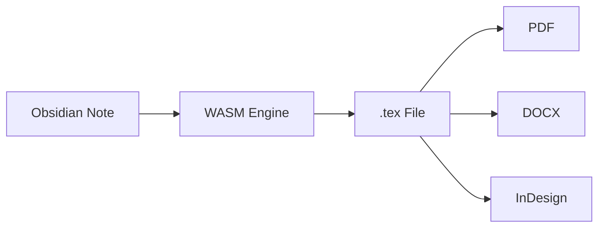
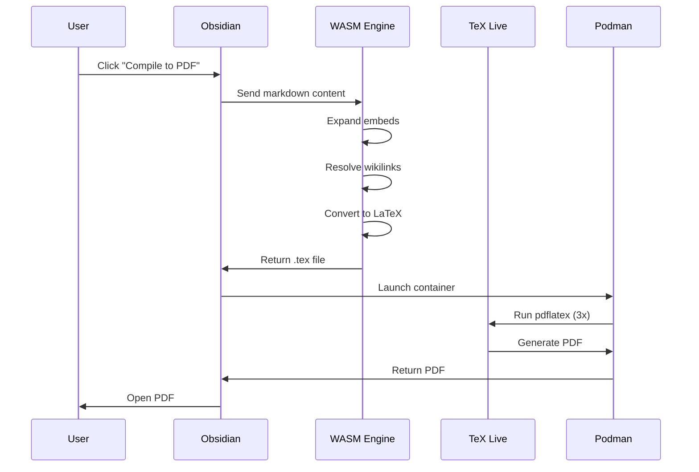

<div align="center">


</div>

# MergDown2TeX

<div class="hero" markdown>

# **Merge everything. Convert anywhere.**

The fastest way to go from Obsidian to LaTeX. Zero dependencies inside Obsidian.

[Get Started](getting-started/installation.md){ .md-button .md-button--primary }
[View on GitHub](https://github.com/dvrch/mergdown2tex){ .md-button }

</div>

---

## What is MergDown2TeX?

MergDown2TeX is an Obsidian plugin that transforms your notes into **publication-ready** LaTeX documents. It merges everything — embeds, citations, Mermaid diagrams, equations, cross-references — into a single `.tex` file.



---

## Features

<div class="grid cards" markdown>

-   :material-link-variant:{ .lg .middle } **Wikilinks**

    ---

    `[[Note]]` → `\hyperref[...]{}` with bidirectional navigation

    [:octicons-arrow-right-24: Learn more](features/cross-references.md)

-   :material-file-document:{ .lg .middle } **Embeds**

    ---

    `![[Note]]` → Recursive expansion with depth limit

    [:octicons-arrow-right-24: Learn more](features/embeds.md)

-   :material-book-open-variant:{ .lg .middle } **Citations**

    ---

    `@citation` → `\citep{}` with ↑↓ arrows

    [:octicons-arrow-right-24: Learn more](features/citations.md)

-   :material-chart-line:{ .lg .middle } **Equations**

    ---

    `$math$` → LaTeX equations with numbering

    [:octicons-arrow-right-24: Learn more](features/equations.md)

-   :material-chart-timeline:{ .lg .middle } **Mermaid Diagrams**

    ---

    `` ```mermaid`` `` → Rendered PNG images

    [:octicons-arrow-right-24: Learn more](features/mermaid.md)

-   :material-file-pdf-box:{ .lg .middle } **PDF Compilation**

    ---

    One click to PDF via TeX Live + Podman

    [:octicons-arrow-right-24: Learn more](compilation/pdf.md)

</div>

---

## How it works



---

## Quick Example

**Input:**
```markdown
---
title: "My Paper"
---

# Introduction

This paper discusses [[Related Work]] and cites @smith2020.

![[Figure 1.png]]

## Methods

We use the formula $E = mc^2$.
```

**Output:**
```latex
\documentclass[12pt]{report}
\usepackage{hyperref}
\usepackage{cite}

\title{My Paper}

\begin{document}

\section{Introduction}
This paper discusses \hyperref[related-work]{Related Work} and cites \citep{smith2020}.

\includegraphics{figures/figure_1.png}

\section{Methods}
We use the formula $E = mc^2$.

\end{document}
```

---

## Install in 3 steps

1. **Download** `main.js`, `manifest.json`, `vlatex_bg.wasm` from [Releases](https://github.com/dvrch/mergdown2tex/releases)
2. **Copy** to `.obsidian/plugins/mergdown2tex/`
3. **Enable** in Settings → Community Plugins

---

## Requirements

| Step | What you need |
|---|---|
| Markdown → LaTeX | **None** (WASM runs in Obsidian) |
| LaTeX → PDF | TeX Live + Podman |
| LaTeX → DOCX | Pandoc |

---

## Why MergDown2TeX?

| | Pandoc Plugin | Pandoc CLI | **MergDown2TeX** |
|---|---|---|---|
| Install required | Pandoc + TeX Live | Pandoc + TeX Live | **WASM only** |
| Wikilink resolution | ❌ | ❌ | ✅ |
| Embed expansion | ❌ | ❌ | ✅ |
| Citation arrows (↑↓) | ❌ | ❌ | ✅ |
| Mermaid → PNG | ❌ | ❌ | ✅ |
| Custom preamble | Partial | Manual | ✅ |
| InDesign output | ❌ | ❌ | ✅ |
| Cross-platform | ⚠️ | ⚠️ | ✅ |

---

## Support

- [GitHub Issues](https://github.com/dvrch/mergdown2tex/issues)
- [Documentation](https://dvrch.github.io/mergdown2tex/)
- [Discord](https://discord.gg/mergdown2tex) (coming soon)

---

## License

Free for personal, academic, community use.  
Commercial: [contact author](https://github.com/dvrch).
