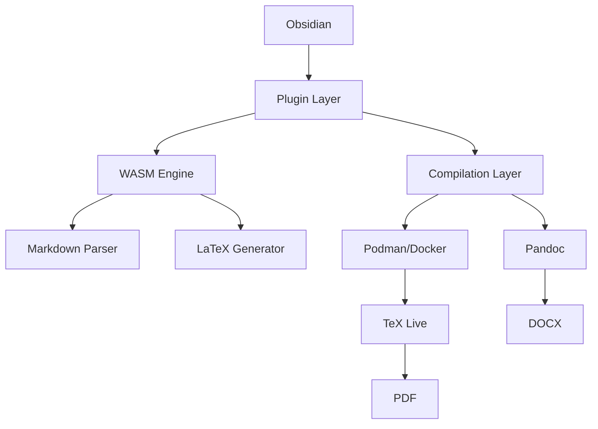
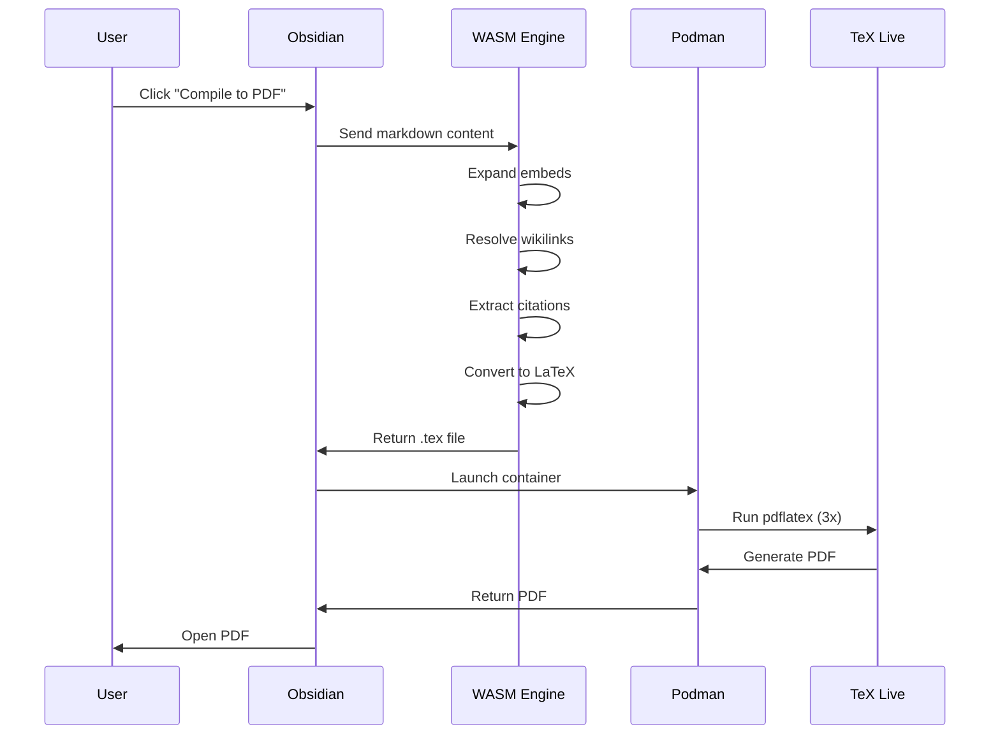
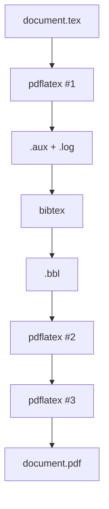
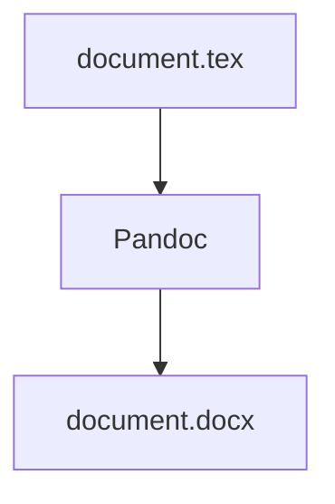

# Architecture

MergDown2TeX technical architecture and design.

---

## System overview



---

## Components

### Plugin Layer

```
main.js (56 KB)
├── Obsidian Plugin API
├── Settings Management
├── Command Registration
├── UI Integration
└── WASM Loading
```

### WASM Engine

```
vlatex_bg.wasm (2.1 MB)
├── Markdown Parser
├── LaTeX Generator
├── Embed Expansion
├── Citation Extraction
└── Mermaid Rendering
```

### Compilation Layer

```
Podman/Docker
├── TeX Live
│   ├── pdflatex
│   ├── bibtex
│   └── LaTeX packages
└── Pandoc
    └── DOCX conversion
```

---

## Data flow



---

## File structure

### Plugin files

```
mergdown2tex/
├── main.js          56 KB   ← Plugin + WASM bindings
├── manifest.json   351 B   ← Obsidian metadata
├── vlatex_bg.wasm  2.1 MB  ← Rust converter engine
└── Dockerfile        1 KB  ← LaTeX environment
```

### Generated files

```
vault/
├── note.md                ← Source note
├── note.tex               ← Generated LaTeX
├── note.pdf               ← Compiled PDF
├── note.docx              ← Compiled DOCX
└── figures/
    ├── diagram_1.png      ← Rendered Mermaid
    └── image.png          ← Copied images
```

---

## WASM engine

### Rust source

```rust
// src/lib.rs
#[wasm_bindgen]
pub fn markdown_to_latex(input: &str) -> String {
    // Convert markdown to LaTeX
}

#[wasm_bindgen]
pub fn expand_embeds(input: &str) -> String {
    // Expand ![[Note]] recursively
}

#[wasm_bindgen]
pub fn extract_citations(input: &str) -> String {
    // Extract @citation references
}
```

### Build process

```bash
# Build WASM
wasm-pack build --target web --out-dir pkg

# Output
pkg/
├── vlatex_bg.wasm
├── vlatex.js
└── vlatex.d.ts
```

---

## Compilation process

### PDF compilation



### DOCX compilation



---

## Performance

### Conversion speed

| Operation | Time |
|---|---|
| Markdown → LaTeX | 0.24s |
| GUI launch | 1s |
| PDF compilation | 30-60s |

### Memory usage

| Component | Memory |
|---|---|
| WASM engine | ~50 MB |
| Podman container | ~500 MB |
| TeX Live | ~2 GB |

---

## Security

### Sandboxing

- WASM runs in browser sandbox
- Podman runs in container sandbox
- No direct filesystem access

### Permissions

- Read: Vault folder
- Write: Output folder
- Execute: Podman/Docker

---

## Next steps

- [Commands](commands.md) - Available commands
- [Settings](settings.md) - Configuration options
- [Troubleshooting](../troubleshooting.md) - Common issues
