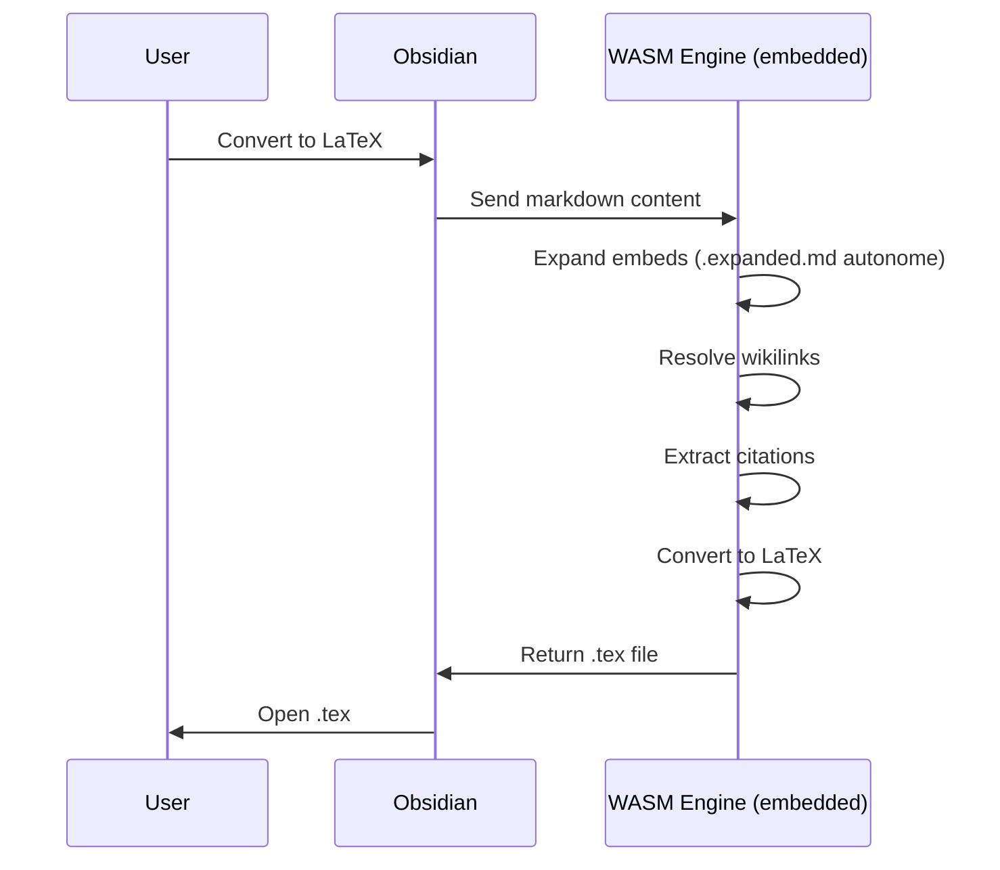
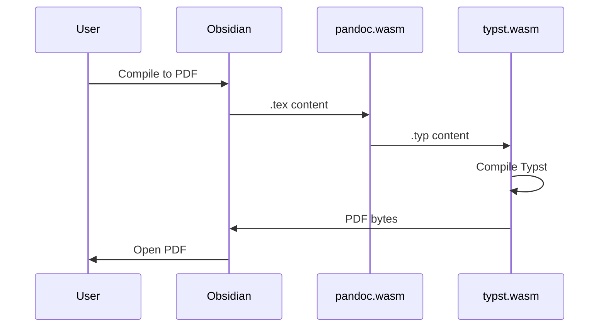
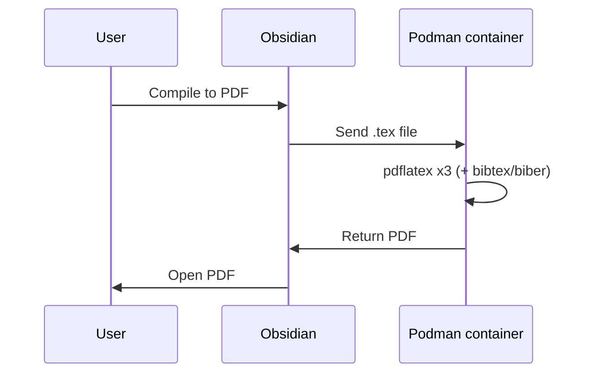
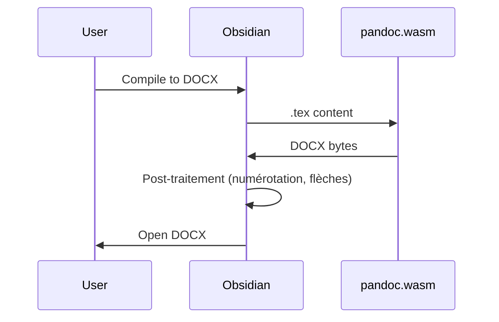

# Architecture

MergDown2TeX technical architecture and design.

---

## System overview

```mermaid
graph TD
    A[Obsidian] --> B[Plugin Layer]
    B --> C[WASM Engine (embedded)]
    C --> E[Markdown Parser]
    C --> F[LaTeX Generator]
    B --> G[Compilation Layer]
    G --> H[Pandoc WASM]
    G --> I[Typst WASM]
    G --> J[pdflatex + Podman (PC)]
    H --> K[DOCX]
    I --> L[PDF]
    J --> L[PDF]
```

---

## Components

### Plugin Layer

```
main.js (~8.6 MB)
├── Obsidian Plugin API
├── Settings Management
├── Command Registration
├── UI Integration
├── WASM Engine (embedded as Base64)
└── Orchestration des pipelines
```

!!! info "WASM embarqué"
    Le moteur de conversion (Markdown → LaTeX) est un module WASM **encodé en Base64 directement dans `main.js`**. Une seule release de 2 fichiers (`main.js` + `manifest.json`) suffit donc à installer le plugin, sans binaire externe à copier.

### Moteurs externes (auto-téléchargés)

| Binaire | Emplacement | Rôle |
|---|---|---|
| `pandoc.wasm` (~59 MB) | `wasm/pandoc.wasm` | Conversion `.tex` → `.docx` |
| `typst.wasm` (~28 MB) | `wasm/typst.wasm` | Conversion `.typ` → PDF |
| `mermaid.min.js` (~3.5 MB) | `resources/mermaid.min.js` | Rendu Mermaid client-side |

Ces binaires sont **auto-téléchargés au premier export** (et via un bouton manuel dans les réglages). Ils ne font pas partie de la release.

### Compilation Layer

```
Pandoc WASM
└── .tex → .docx (avec --mathml, --embed-resources, --standalone, --toc)

Typst WASM (PDF pipeline sans Podman)
└── .tex → .typ → PDF

pdflatex + Podman (PC, rendu LaTeX natif)
├── TeX Live (pdflatex, bibtex, LaTeX packages)
└── vlatex-env container
```

---

## Data flow

### Markdown → LaTeX (toujours WASM embarqué)


```mermaid
sequenceDiagram
    participant U as User
    participant O as Obsidian
    participant W as WASM Engine (embedded)

    U->>O: Convert to LaTeX
    O->>W: Send markdown content
    W->>W: Expand embeds (.expanded.md autonome)
    W->>W: Resolve wikilinks
    W->>W: Extract citations
    W->>W: Convert to LaTeX
    W->>O: Return .tex file
    O->>U: Open .tex
```

### PDF — pipeline Typst (par défaut mobile, PC optionnel)


```mermaid
sequenceDiagram
    participant U as User
    participant O as Obsidian
    participant P as pandoc.wasm
    participant T as typst.wasm

    U->>O: Compile to PDF
    O->>P: .tex content
    P->>T: .typ content
    T->>T: Compile Typst
    T->>O: PDF bytes
    O->>U: Open PDF
```

### PDF — pipeline pdflatex + Podman (PC uniquement)


```mermaid
sequenceDiagram
    participant U as User
    participant O as Obsidian
    participant P as Podman container

    U->>O: Compile to PDF
    O->>P: Send .tex file
    P->>P: pdflatex x3 (+ bibtex/biber)
    P->>O: Return PDF
    O->>U: Open PDF
```

### DOCX


```mermaid
sequenceDiagram
    participant U as User
    participant O as Obsidian
    participant P as pandoc.wasm

    U->>O: Compile to DOCX
    O->>P: .tex content
    P->>O: DOCX bytes
    O->>O: Post-traitement (numérotation, flèches)
    O->>U: Open DOCX
```

---

## File structure

### Plugin files (release)

```
mergdowntotex/
├── main.js           ~8.6 MB  ← Plugin + moteur WASM embarqué (Base64)
└── manifest.json   351 B   ← Obsidian metadata
```

!!! note "Deux emplacements identiques"
    La même installation vit à **deux endroits**, strictement identiques (`main.js`, `manifest.json`, `wasm/`, `resources/`) :
    1. **Structure de la release** : `mergdowntotex/` (au `root` du dépôt).
    2. **Vault exemple** : dans `example_vault/full_manual_repport_exp.zip`, le plugin est installé à `.obsidian/plugins/mergdowntotex/` et se re-déploie automatiquement à l'ouverture du vault.

### Au premier lancement (créés automatiquement)

```
mergdowntotex/
├── wasm/
│   ├── pandoc.wasm   ~59 MB  ← auto-téléchargé (DOCX)
│   └── typst.wasm    ~28 MB  ← auto-téléchargé (PDF)
└── resources/
    ├── mermaid.min.js        ← rendu Mermaid
    └── csl/                  ← styles de citation
```

### Generated files

```
vault/
├── note.md                ← Source note
├── note.tex               ← Generated LaTeX
├── note.pdf               ← Compiled PDF (Typst ou pdflatex)
├── note.docx              ← Compiled DOCX (Pandoc WASM)
├── note.typ               ← Typst intermediare (si "Garder le .typ")
├── note.expanded.md       ← Markdown autonome étendu (dans .private/)
├── note_exp.zip           ← ZIP des ressources liées
└── figures/
    ├── diagram_1.png      ← Rendered Mermaid
    └── image.png          ← Copied images
```

---

## WASM engine

### embarqué dans main.js

Le moteur Rust est compilé en WASM puis encodé en Base64 dans `main.js`. À l'exécution, `initWasmEmbedded()` décode et instancie le module :

```js
// extrait de main.js
initWasmEmbedded() {
  const bytes = _b64toBytes(WASM_BASE64);  // WASM_BASE64 = ...encoded in main.js
  // → module WebAssembly, compatible "on-line"
  WebAssembly.instantiate(bytes, imports);
}
```

En **mode développement** (code source non minifié), le fallback `initWasm(path)` utilise un fichier WASM externe :

```bash
# Build WASM
wasm-pack build --target web --out-dir pkg
# seul le binaire est ensuite encodé en Base64 dans main.js à la compilation de la release
```

---

## Auto-téléchargement des moteurs

Lors du premier export, le plugin **vérifie puis télécharge** les binaires manquants :

```
ensurePandocWasm()  → wasm/pandoc.wasm  (s'il manque → downloadPandocWasm())
ensureTypstWasm()  → wasm/typst.wasm   (s'il manque → downloadTypstWasm())
```

- Déclenchés par une commande d'export ou par le **bouton de téléchargement manuel** des réglages
- Nécessite une connexion internet (59 MB + 28 MB)

---

## Pipeline PDF : le choix du moteur

| Contexte | Pipeline utilisé |
|---|---|
| **Mobile** (iOS/Android) | Pandoc WASM + Typst (recommandé, aucune installation) |
| **PC**, réglage `PDF PC via Wasm+Typst` **désactivé** | pdflatex + Podman (`vlatex-env`) |
| **PC**, réglage `PDF PC via Wasm+Typst` **activé** | Pandoc WASM + Typst |

Le rendu LaTeX natif (pdflatex) n'est disponible que sur PC, car il repose sur un conteneur Podman/Docker.

---

## Performance

### Conversion speed

| Operation | Time |
|---|---|
| Markdown → LaTeX | 0.24s |
| GUI launch | 1s |
| PDF compilation (Typst) | ~quelques secondes |
| PDF compilation (pdflatex + Podman) | 30-60s |

### Memory usage

| Component | Memory |
|---|---|
| WASM engine (embedded) | ~50 MB |
| pandoc.wasm / typst.wasm | ~100-200 MB chacun |
| Podman container (pdflatex) | ~500 MB |
| TeX Live | ~2 GB |

---

## Security

### Sandboxing

- WASM runs in browser sandbox
- Podman runs in container sandbox
- No direct filesystem access

### Permissions

- Read: Vault folder
- Write: Output folder
- Execute: Podman/Docker (mode pdflatex uniquement)

---

## Next steps

- [Commands](commands.md) - Available commands
- [Settings](settings.md) - Configuration options
- [Troubleshooting](../troubleshooting.md) - Common issues