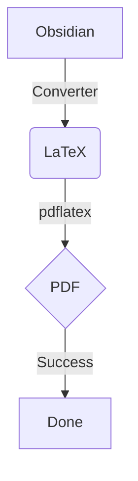

%%
size_in_latex:: 0.2
caption_short::
caption_long:: 
subfigure_widths:: 
subfigure_abs_or_rel:: abs
subfigure_captions::  
cover_all_columns:: 
%%
%% fig %%

```mermaid
graph TD
    A[Obsidian] -->|Converter| B(LaTeX)
    B -->|pdflatex| C{PDF}
    C -->|Success| D[Done]
```

